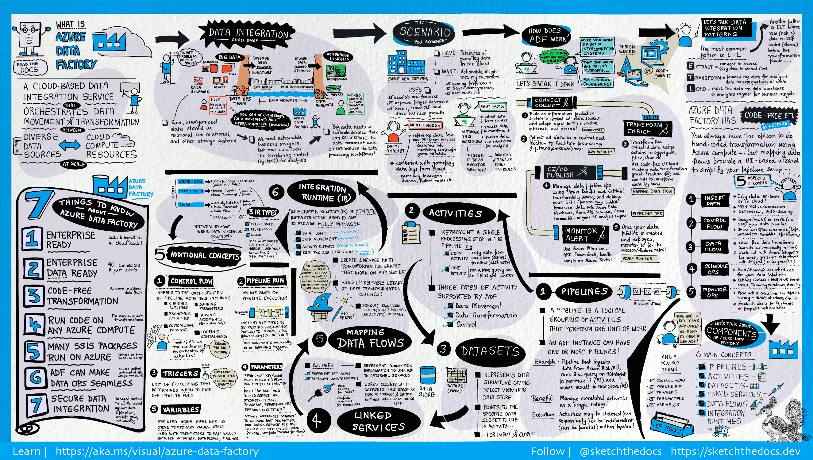

# Databricks
- Core of Azure Databricks is Apache Spark
- Databricks is a company created by founders of Spark
- Available on Azure
- Give:
    + Clusters
    + Workspace/Notebook
    + Administrator on Controls
    + Optimized Spark (5x faster)
    + Database/Tables
    + Delta Lake
    + SQL Analytics
    + MLFlow

# Spark
## Architecture

                        ______________________________________________________________
                        |             |                                              |
                        |             |  Spark Streaming     Spark ML    Spark Graph |
                        |  Spark SQL  |______________________________________________|
                        |             |                                              |
                        |             |          DataFrame / Dataset APIs            |
                        |_____________|______________________________________________|
                        ______________________________________________________________
                        |                      SPARK SQL Engine                      |
                        |____________________________________________________________|  
                        |                                                            |
                        |        Catalyst Optimizer                 Tungsten         |
                        |____________________________________________________________|
                        ______________________________________________________________
                        |                          SPARK CORE                        |
                        |____________________________________________________________|  
                        |                                                            |
                        |    Scala           Python           Java              R    |
                        |____________________________________________________________|
                        |                                                            |
                        |            Resilient Distributed Dataset (RDD)             |
                        |____________________________________________________________|

                        ______________________________________________________________
                        |                                                            |
                        |      Spark Standalone, Yarn, Apache Mesos, Kubernetes      |
                        |____________________________________________________________|

- `Catalyst optimizer:` Converting a computational query to a highly efficient execution plan
- `Tungsten:` Memory management and CPU efficiency

# Azure Databricks Architecture

`- Control Plane (Databricks Subscription)`
    + Databricks UX
    + Databricks Cluster Manager
    + DBFS (Databricks File System)
    + Metadata about Clusters

`- Data Plane (Customer Subscription)`
    + Virtual Network and Network Security Group for the Virtual Network
    + Azure Blob Storage
    + Databricks Workspace

# Databricks Cluster
## Basically is a collection of VMs (Virtual Machines)

                                                        VM
                                                      Driver
                                                     /   |  \
                                                    /    |   \
                                                   /     |    \
                                                  /      |     \
                                                VM      VM      VM
                                              Worker  Worker  Worker

## Cluster Types
                _________________________________________________________________________________
                |            All Purpose                 |               Job Cluster            |
                |________________________________________|______________________________________|
                |                                        |                                      |
                |   Created manually                     |   Created by jobs                    |
                |   Persistent                           |   Terminated at the end of the job   |
                |   Suitable for interactive workloads   |   Suitable for automated workloads   |
                |   Shared among many users              |   Isolated just for the job          |
                |   Expensive to run                     |   Cheaper to run                     |
                |________________________________________|______________________________________|

## Cluster Configuration
- `Single / Multi Node`

    + `Single:` Driver Node is Worker Node too. Not suitable for horizontally scalable
    + `Multi Node:` 1 Driver Node and many Workers Node

- `Access Mode`

    + `Single User: `
        + Only One User Access, 
        + Supports Python, SQL, Scala, R
    + `Shared: `
        + Multiple User Access, Provide process isolation. 
        + Each process get its environment. So one process cannot see the data or the credential used by the other (Only on Premium) 
        + Support Python, SQL.
    + `No Isolation Shared:`
        + Same with `Shared` but not `provide process isolation`. So failure can affect the others
        + Support Python, SQL, Scala, R

- `Databricks Runtime`

    + `Databricks Runtime:`
        + Include an optimized version of Apache Spark Library
        + Python, Scala, Java, R Libraries
        + Ubuntu libraries
        + GPU Libraries for GPU enabled Clusters
        + Delta Lake Libraries
        + Other libraries for other services
    + `Databricks Runtime ML:`
        + Everything from Databricks Runtime
        + Popular ML Libraries (Pytorch, Keras, Tensorflow, XGBoosts..)
    + `Photon Runtime:`
        + Everything from Databricks Runtime
        + `Photon Engine:` Databricks native vectorized query engine, that runs SQL workloads faster and reduce cost per workload
    + `Databricks Runtime Light:`
        + Runtime option for only job not requiring advanced features
        + Only suitable for `Automated Workloads`

- `Auto Termination`
    + Terminate the cluster after `x minutes` of inactivity
    + Default value for `Single Node` and `Standard Clusters` is `120 minutes`
    + Users can specify a value between 10 and 10000 mins as the duration

- `Auto Scaling`
    + User specifies the min and max work nodes
    + Auto scales between min and max based on the workload
    + Not recommended for streaming workloads

- `Cluster VM Type/Size`
    + Memory Optimized
    + Compute Optimized
    + Storage Optimized
    + General Purpose
    + GPU Accelerated

- `Cluster Policy`
    + Simplifies the user interface
    + Enables standard users to create clusters
    + Achieves cost control
    + `Only available for premium`

## Databricks Utilities
- `File System Utilities:` Allow access databricks file system from a notebook and you can use various file system level operations
- `Secrets Utilities:` Allow get secret values from secrets, which are stored in secret scopes backed by Databricks or Azure Key Vault
- `Widget Utilities:` Allow to parameterized notebooks a calling notebook or another application
    + Ex: A Data Factory Pipeline can pass a parameter value to the notebook at runtime. Really useful to make a notebook reusable
- `Notebook Workflow Utilities:` Allow invoke one notebook from another and chian them together

## Azure Data Lake
- Azure Data Lake Storage Gen2 as Data Lake storage solution
- 2 Keys:
    + `Storage Access Keys:` Each Azure storage account have 1
    + `Shared Access Signature (SAS Token):` Manage access at more granular level than the Access Key
    + `Service Principal`: Give the required access for the Data Lake to the Service Principal and used those credentials to access the storage account  
    + All of those 3 options take two forms:
        + `Session Scoped Authentication:` Use these credentials in the notebook and authenticate to the Data Lake (the authentication just valid duration the session - Until the notebook has been detached to the cluster)
        + `Cluster Scoped Authentication:` The authentication will happen when the cluster starts and it will be valid until the Cluster has been terminated. All notebook connect to this cluster can access the data
        + `The Other:`
            + `AAD Passthrough Authentication:` 
                + Just need to enable the Cluster to use. Azure Active Directory Pass-through Authentication. Whenever a user run a Notebook, the cluster will use the user's Azure Active Directory credentials and look for the roles
                + If the user has access to the storage account, it will allow the user to access the storage account. Otherwise, the user won't be able to access the storage
                + Available on premium workspace
            + `Unity Catalog:` 
                + The administrator can define the access permissions, for an user using the Databricks Unity Catalog
                + When access. It's will check the user in the Unity Catalog. If user has the required permission. It will allow user access storage account. Otherwise, no
                + Available on premium workspace

## Access Azure Data Lake using Access Keys
- Each storage account comes with 2 512-bit keys
- The access key give full access to the storage account => Secure them in Azure Key Vault
- Keys can be rotated (regenerated)
- Databricks and Azure Data Lake recommends using the ABFS (Azure Blob File System driver)
    + Part of the Apache Hadoop 
    + Optimized for big data analytics
    + Offers better security
    + [Data Lake Storage ABFS Driver](http://learn.microsoft.com/en-us/azure/storage/blobs/data-lake-storage-abfs-driver)
```bash
spark.conf.set("fs.azure.account.key.<storage_account>.dfs.core.windows.net","<access_key>")

# input the s at the end for more security
abfs[s]://container@storage_account_name.dfs.core.windows.net/folder_path/file_name

# conclusion
spark.conf.set("fs.azure.account.key.<storage_account>.dfs.core.windows.net","<access_key>")

dbutils.fs.ls("abfs[s]://container@storage_account_name.dfs.core.windows.net/")

```

## Access Azure Data Lake using SAS Token
- Can be used to control access at a more granular level
- Restrict access to specific resource types/services
- Allow specific permissions
- Restrict access to specific time period
- Limit access to specific IP addresses
- Recommended access pattern for external clients
[Storage SAS Overview](https://learn.microsoft.com/en-us/azure/storage/common/storage-sas-overview)

```bash
# spark conf
spark.conf.set("fs.azure.account.auth.type.<storage_account>.dfs.core.windows.net","SAS")
spark.conf.set("fs.azure.sas.token.provider.type.<storage_account>.dfs.core.windows.net","org.apache.hadoop.fs.azurebfs.sas.FixedSASTokenProvider")
spark.conf.set("fs.azure.sas.fixed.token.<storage_account>.dfs.core.windows.net","<token>")
```

## Access Azure Data Lake using Service Principal
- Quite similar to user accounts can registered in Azure Active Directory and assigned permissions required to access the resources in the Azure subscription via role-based access control or RBAC and can create custom role
- Recommended method to be used in automated tools such as Databricks jobs as well as CI/CD pipelines
- Each application will have its own Service Principal
- Not for `student subscription`
- Step for using in Data Lake
    - 1 . Register Azure AD (Active Directory) Application / Service Principal
    - 2 . Generate a secret / password for the Application
    - 3 . Set Spark Config with App / Client id, Directory / Tenant id % Secret
    - 4 . Assign Role `Storage Blob Data Contributor` to the Data Lake

## Session Scoped Authentication
- Just authentication during the session. When detach the cluster. Cannot re-authentication

## Cluster Scoped Authentication
- Can authentication all the notebook in the authenticated cluster

## AAD Credential Passthrough
- Databricks will pass the users, Azure Active Directory credentials to the ADL storage account to authenticate\
- If the specific user has the required role assigned in RBAC (Azure role-based access control) for the storage account, they will be able to access the storage account
- Useful in Multiple Machine Learning Engineers use the same Databricks Cluster, but each one should have access to only specific storage account
- Only available for workspaces in premium

## Secret Scope
- Store the credentials securely and reference them in notebooks, clusters and jobs when required
- `2 Types:`
    - Databricks backed Secret Scope
        - Backed by an encrypted databricks database owned and managed by Databricks
        - We can create and alter the encrypted database using the Databricks CLI or the API
        - It cannot be done via the GUI
    - Azure Key-Vault backed Secret Scope
        - Created and managed in Azure Key Vault
        - Recommended approach when using Databricks on Azure
        - The secrets can be shared amongst other Azure Services
        - Where all secrets are kept and maintained

### Azure Key-Vault Create:
- `Step 1:` Create key vault resources
- `Step 2:` Create a secret
- `Step 3:` Create Scope Secret (Databricks)
    - `Step 3.1:` Go to page https://adb-21534837349570.10.azuredatabricks.net/?o=21534837349570#secrets/createScope
    - `Step 3.2:` Set the DNS Name and Resources ID (Get from the properties in key vault resources)
    - `Now setup in Cluster`
        - fs.azure.account.key.<storage_account>.dfs.core.windows.net" {{secret/<name_secret_scope>/<key_name>}} (Example to assign key into cluster)

## Databricks Mounts

### Databricks File System (DBFS)


- `DBFS (Databricks File System)`: 
    - Distributed file system mounted on the Databricks workspace. 
    - Can access from any of the Databricks Clusters created in this workspace. It 
    - Just a abstraction layer on top of the Azure Object Storage
- `DBFS Root`:
    - The default storage for a Databricks workspace created during workspace deployment
    - Backed by the default Azure Blob Storage
    - Can access special folders within DBFS Root called File Store via the Web UI
    - Store query results from commands such as display in DBFS Root. Similar Hive
    - Allow create both managed and external tables
    - Not recommended location to store customer data
    - If drop databricks workspace. Data drop too
    - => Use external Data Lake, fully controlled by the customer and we can mount that to the workspace

- `DBFS Mount Step-by-step`:
    


## Hive Meta Store
### Hive Meta Store
- Hive Meta Store keeps the information about the file, such as the location, name of the file, table, column
- Is the most commonly used metadata in the Data Lake space
    + Databricks default managed Meta Store
    + External Storage Meta Store (Azure SQL, MySQL, MariaDB...) 


### Spark Database/ Tables/ Views
- Databricks Workspace
    - Database
        - Table
            - `Managed:` 
                - Databricks managed the file and the metadata
                - Dtop table => delete the file
            - `External:` 
                - We managed file, hive meta store managed the metadata
                - Drop the table for an EXTERNAL TABLE doesn't delete the file
        - View
            - Can be built on the tables with the selection of data

## FORMULA1 PROJECT


## Incremental Load

### Data Load Types
- Full Load
    - Won't suitable for large data pipelines
    - Use case: Received all of the data every time => Ok
- Incremental Load
    - Load and Process the data that has changed between the current run and previous run
    - Use case: Received data that's changed since the last load
- Hybrid


# Delta Lakes

### Pitfalls of Data Lakes

#### Data warehouse ability


- `Delta Lake` is a project originally developed by Databricks and then open sourced under the Linux Foundation
- Open source storage layer that brings reliability to Data Lakes
- Provides ACID transactoins, scalable metadata handling, and it unifies streaming as well as batch
#### => Problem of Data Lake: Too slow to interactive BI reports, and there was lack of governance(quản trị) for the data


### ACID:
- `Atomicity`: Ensures that all parts of a transaction are completed; if any part of the transaction fails, the entire transaction is rolled back.

- `Consistency`: Guarantees that a transaction can only bring the database from one valid state to another, maintaining the rules and constraints of the database.

- `Isolation`: Ensures that transactions are executed independently of one another, so intermediate states of a transaction are not visible to others.

- `Durability`: Guarantees that once a transaction is committed, it will remain so, even in the event of a system failure.

- **Delta Lakes run on top of Data Lakes**
- Fully compatible with Apache Spark APIs

### Data Lakehouse


### Delta Lake


# Azure Data Factory
- A fully managed, serverless data integration solution for ingesting, prepare and transforming all of your data scale

#### Azure data prolem


#### What azure factory can do


#### What azure factory should not use for


#### Azure Data Factory Components

Azure Data Factory (ADF): Fully managed, serverless data integration solution for ingesting, preparing and transforming all of data at scale



1. [Pipeline](#pipeline)
2. [Mapping Data Flow](#mapping-data-flows)
3. [Activity](#activity)
4. [Datasets](#datasets)
5. [Linked Service](#linked-service)
6. [Integration Runtime (IR)](#integration-runtime)
7. [Triggers](#triggers)
8. [Pipeline runs](#pipeline-runs)
9. [Parameters](#parameters)
11. [Control Flow](#control-flow)
12. [Variables](#variables)

### Pipeline
- logical grouping of activities that performs a unit of work
- Together, the activities in a pipeline perform a task. 
- manage the activities as a set instead of managing each one individually
    - The activities in a pipeline can be chained together to operate sequentially, or they can operate independently in parallel.
    
`E.g. pipeline can contain a group of activities that ingests data from an Azure blob, and then runs a Hive query on an HDInsight cluster to partition the data.

### Mapping data flows
- create and manage graphs of data transformation logic that can use to transform any-sized data
- Data Factory will execute your logic on a SPark cluster that spins-up and spins-down when you need it (not have to manage/maintain clusters)

### Activity
- a processing step in a pipeline
- ADF support `3` types of activities: data movement, data transformation, control activities

`E.g. use a copy activity to copy data from one data store to another; use a Hive activity, which runs a Hive query on an Azure HDInsight cluster, to transform or analyze your data`

### Datasets
- data structures within data stores
- point to/ reference the data you want to use in your activitied as inputs/outputs

### Linked services
- connection strings
- define the connection info that's needed for Data Factory to connect to external resources

-> **a linked service defines the connection to the data source, and a dataset represents the structure of the data**

- Used for 2 purposes:
    - represent a **[data store](https://learn.microsoft.com/en-us/azure/data-factory/copy-activity-overview#supported-data-stores-and-formats)** (SQL Server, Oracle, file share, Azure blob storage account, etc.)
    - represent a **[compute resource](https://learn.microsoft.com/en-us/azure/data-factory/transform-data)** that can host the execution of an actitify 

### Integration Runtime
- provide bridge between activity & linked services
- referenced by linked service/activity & provide compute environment where the activity can be performed in the region closest possible to the target data store/compute service in the most performant way while meeting security and compliance needs

### Triggers
- unit of processing that determines when a pipeline execution needs to be kicked off
- different types of triggers for different types of events

### Pipeline runs
- an instance of the pipelinee execution
- typically instantiated by passing arguments to the parameters that are defined in pipelines
- can be passed manually or within trigger definition

### Parameters
- key-value pairs of read-only config
- defined in the pipeline
- arguments for defined parameters are passed during execution from the run context that was created by a trigger/ a pipeline was executed manually - activity within the pipeline consume param values
- A `dataset`: strongly typed parameter, a reusable/referenceable entity (i.e. an activity can reference datasets & consume the properties that are defined in dataset definiton)
- A `linked service`: strongly typed parameter, reusable/referenceable entity that contains connection info to either data store/ compute environment 

### Control Flow
- orchestration of pipeline activities that includes chaining activities in a seuqnece, branching, defining parameters at the pipeline level and passing arguments while invoking the pipeline eon-demand or from a trigger
- includes custom-state passing and looping containers (for-each interators)

### Variables
- used inside of pipeleines to store temporary values and also inconjunction with parameters to enable passing values between pipelines, data flows, and other activities


## Unity Catalog
- Databricks offered unified solution for implementing data governance in the Data Lakehouse

### Data Governance
- Is the process of managing the availability, usability, integrity and security of the data present in an enterprise   
- An enterprise should be able to
    + Control access to the data for the users
    + Ensures that the data is trust worthy and not misused
    + Helps implement privacy regulations such as GDPR, CCPA etc

- 4 keys data governance in unity catalog


- With and without unity catalog


- Setup unity catalog


# `Credits`
**All credit to [@hhtrieu0108](https://github.com/hhtrieu0108) for this beautifully crafted, visually explained, and meticulously detailed documentation!**