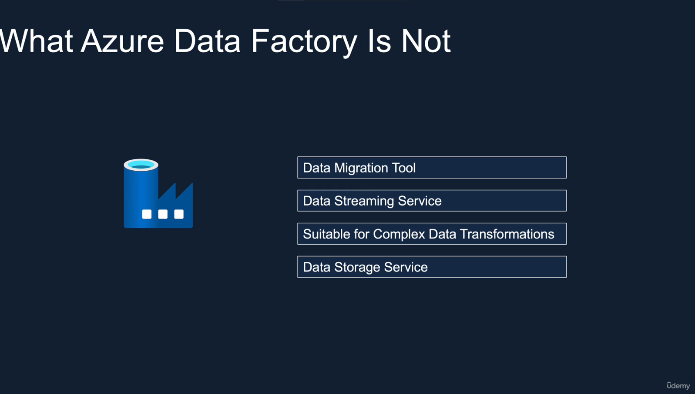

# Databricks
- Core of Azure Databricks is Apache Spark
- Databricks is a company created by founders of Spark
- Available on Azure
- Give:
    + Clusters
    + Workspace/Notebook
    + Administrator on Controls
    + Optimized Spark (5x faster)
    + Database/Tables
    + Delta Lake
    + SQL Analytics
    + MLFlow

# Spark
## Architecture

                        ______________________________________________________________
                        |             |                                              |
                        |             |  Spark Streaming     Spark ML    Spark Graph |
                        |  Spark SQL  |______________________________________________|
                        |             |                                              |
                        |             |          DataFrame / Dataset APIs            |
                        |_____________|______________________________________________|
                        ______________________________________________________________
                        |                      SPARK SQL Engine                      |
                        |____________________________________________________________|  
                        |                                                            |
                        |        Catalyst Optimizer                 Tungsten         |
                        |____________________________________________________________|
                        ______________________________________________________________
                        |                          SPARK CORE                        |
                        |____________________________________________________________|  
                        |                                                            |
                        |    Scala           Python           Java              R    |
                        |____________________________________________________________|
                        |                                                            |
                        |            Resilient Distributed Dataset (RDD)             |
                        |____________________________________________________________|

                        ______________________________________________________________
                        |                                                            |
                        |      Spark Standalone, Yarn, Apache Mesos, Kubernetes      |
                        |____________________________________________________________|

- `Catalyst optimizer:` Converting a computational query to a highly efficient execution plan
- `Tungsten:` Memory management and CPU efficiency

# Azure Databricks Architecture

`- Control Plane (Databricks Subscription)`
    + Databricks UX
    + Databricks Cluster Manager
    + DBFS (Databricks File System)
    + Metadata about Clusters

`- Data Plane (Customer Subscription)`
    + Virtual Network and Network Security Group for the Virtual Network
    + Azure Blob Storage
    + Databricks Workspace

# Databricks Cluster
## Basically is a collection of VMs (Virtual Machines)

                                                        VM
                                                      Driver
                                                     /   |  \
                                                    /    |   \
                                                   /     |    \
                                                  /      |     \
                                                VM      VM      VM
                                              Worker  Worker  Worker

## Cluster Types
                _________________________________________________________________________________
                |            All Purpose                 |               Job Cluster            |
                |________________________________________|______________________________________|
                |                                        |                                      |
                |   Created manually                     |   Created by jobs                    |
                |   Persistent                           |   Terminated at the end of the job   |
                |   Suitable for interactive workloads   |   Suitable for automated workloads   |
                |   Shared among many users              |   Isolated just for the job          |
                |   Expensive to run                     |   Cheaper to run                     |
                |________________________________________|______________________________________|

## Cluster Configuration
- `Single / Multi Node`

    + `Single:` Driver Node is Worker Node too. Not suitable for horizontally scalable
    + `Multi Node:` 1 Driver Node and many Workers Node

- `Access Mode`

    + `Single User: `
        + Only One User Access, 
        + Supports Python, SQL, Scala, R
    + `Shared: `
        + Multiple User Access, Provide process isolation. 
        + Each process get its environment. So one process cannot see the data or the credential used by the other (Only on Premium) 
        + Support Python, SQL.
    + `No Isolation Shared:`
        + Same with `Shared` but not `provide process isolation`. So failure can affect the others
        + Support Python, SQL, Scala, R

- `Databricks Runtime`

    + `Databricks Runtime:`
        + Include an optimized version of Apache Spark Library
        + Python, Scala, Java, R Libraries
        + Ubuntu libraries
        + GPU Libraries for GPU enabled Clusters
        + Delta Lake Libraries
        + Other libraries for other services
    + `Databricks Runtime ML:`
        + Everything from Databricks Runtime
        + Popular ML Libraries (Pytorch, Keras, Tensorflow, XGBoosts..)
    + `Photon Runtime:`
        + Everything from Databricks Runtime
        + `Photon Engine:` Databricks native vectorized query engine, that runs SQL workloads faster and reduce cost per workload
    + `Databricks Runtime Light:`
        + Runtime option for only job not requiring advanced features
        + Only suitable for `Automated Workloads`

- `Auto Termination`
    + Terminate the cluster after `x minutes` of inactivity
    + Default value for `Single Node` and `Standard Clusters` is `120 minutes`
    + Users can specify a value between 10 and 10000 mins as the duration

- `Auto Scaling`
    + User specifies the min and max work nodes
    + Auto scales between min and max based on the workload
    + Not recommended for streaming workloads

- `Cluster VM Type/Size`
    + Memory Optimized
    + Compute Optimized
    + Storage Optimized
    + General Purpose
    + GPU Accelerated

- `Cluster Policy`
    + Simplifies the user interface
    + Enables standard users to create clusters
    + Achieves cost control
    + `Only available for premium`

## Databricks Utilities
- `File System Utilities:` Allow access databricks file system from a notebook and you can use various file system level operations
- `Secrets Utilities:` Allow get secret values from secrets, which are stored in secret scopes backed by Databricks or Azure Key Vault
- `Widget Utilities:` Allow to parameterized notebooks a calling notebook or another application
    + Ex: A Data Factory Pipeline can pass a parameter value to the notebook at runtime. Really useful to make a notebook reusable
- `Notebook Workflow Utilities:` Allow invoke one notebook from another and chian them together

## Azure Data Lake
- Azure Data Lake Storage Gen2 as Data Lake storage solution
- 2 Keys:
    + `Storage Access Keys:` Each Azure storage account have 1
    + `Shared Access Signature (SAS Token):` Manage access at more granular level than the Access Key
    + `Service Principal`: Give the required access for the Data Lake to the Service Principal and used those credentials to access the storage account  
    + All of those 3 options take two forms:
        + `Session Scoped Authentication:` Use these credentials in the notebook and authenticate to the Data Lake (the authentication just valid duration the session - Until the notebook has been detached to the cluster)
        + `Cluster Scoped Authentication:` The authentication will happen when the cluster starts and it will be valid until the Cluster has been terminated. All notebook connect to this cluster can access the data
        + `The Other:`
            + `AAD Passthrough Authentication:` 
                + Just need to enable the Cluster to use. Azure Active Directory Pass-through Authentication. Whenever a user run a Notebook, the cluster will use the user's Azure Active Directory credentials and look for the roles
                + If the user has access to the storage account, it will allow the user to access the storage account. Otherwise, the user won't be able to access the storage
                + Available on premium workspace
            + `Unity Catalog:` 
                + The administrator can define the access permissions, for an user using the Databricks Unity Catalog
                + When access. It's will check the user in the Unity Catalog. If user has the required permission. It will allow user access storage account. Otherwise, no
                + Available on premium workspace

## Access Azure Data Lake using Access Keys
- Each storage account comes with 2 512-bit keys
- The access key give full access to the storage account => Secure them in Azure Key Vault
- Keys can be rotated (regenerated)
- Databricks and Azure Data Lake recommends using the ABFS (Azure Blob File System driver)
    + Part of the Apache Hadoop 
    + Optimized for big data analytics
    + Offers better security
    + [Data Lake Storage ABFS Driver](http://learn.microsoft.com/en-us/azure/storage/blobs/data-lake-storage-abfs-driver)
```bash
spark.conf.set("fs.azure.account.key.<storage_account>.dfs.core.windows.net","<access_key>")

# input the s at the end for more security
abfs[s]://container@storage_account_name.dfs.core.windows.net/folder_path/file_name

# conclusion
spark.conf.set("fs.azure.account.key.<storage_account>.dfs.core.windows.net","<access_key>")

dbutils.fs.ls("abfs[s]://container@storage_account_name.dfs.core.windows.net/")

```

## Access Azure Data Lake using SAS Token
- Can be used to control access at a more granular level
- Restrict access to specific resource types/services
- Allow specific permissions
- Restrict access to specific time period
- Limit access to specific IP addresses
- Recommended access pattern for external clients
[Storage SAS Overview](https://learn.microsoft.com/en-us/azure/storage/common/storage-sas-overview)

```bash
# spark conf
spark.conf.set("fs.azure.account.auth.type.<storage_account>.dfs.core.windows.net","SAS")
spark.conf.set("fs.azure.sas.token.provider.type.<storage_account>.dfs.core.windows.net","org.apache.hadoop.fs.azurebfs.sas.FixedSASTokenProvider")
spark.conf.set("fs.azure.sas.fixed.token.<storage_account>.dfs.core.windows.net","<token>")
```

## Access Azure Data Lake using Service Principal
- Quite similar to user accounts can registered in Azure Active Directory and assigned permissions required to access the resources in the Azure subscription via role-based access control or RBAC and can create custom role
- Recommended method to be used in automated tools such as Databricks jobs as well as CI/CD pipelines
- Each application will have its own Service Principal
- Not for `student subscription`
- Step for using in Data Lake
    - 1 . Register Azure AD (Active Directory) Application / Service Principal
    - 2 . Generate a secret / password for the Application
    - 3 . Set Spark Config with App / Client id, Directory / Tenant id % Secret
    - 4 . Assign Role `Storage Blob Data Contributor` to the Data Lake

## Session Scoped Authentication
- Just authentication during the session. When detach the cluster. Cannot re-authentication

## Cluster Scoped Authentication
- Can authentication all the notebook in the authenticated cluster

## AAD Credential Passthrough
- Databricks will pass the users, Azure Active Directory credentials to the ADL storage account to authenticate\
- If the specific user has the required role assigned in RBAC (Azure role-based access control) for the storage account, they will be able to access the storage account
- Useful in Multiple Machine Learning Engineers use the same Databricks Cluster, but each one should have access to only specific storage account
- Only available for workspaces in premium

## Secret Scope
- Store the credentials securely and reference them in notebooks, clusters and jobs when required
- `2 Types:`
    - Databricks backed Secret Scope
        - Backed by an encrypted databricks database owned and managed by Databricks
        - We can create and alter the encrypted database using the Databricks CLI or the API
        - It cannot be done via the GUI
    - Azure Key-Vault backed Secret Scope
        - Created and managed in Azure Key Vault
        - Recommended approach when using Databricks on Azure
        - The secrets can be shared amongst other Azure Services
        - Where all secrets are kept and maintained

### Azure Key-Vault Create:
- `Step 1:` Create key vault resources
- `Step 2:` Create a secret
- `Step 3:` Create Scope Secret (Databricks)
    - `Step 3.1:` Go to page https://adb-21534837349570.10.azuredatabricks.net/?o=21534837349570#secrets/createScope
    - `Step 3.2:` Set the DNS Name and Resources ID (Get from the properties in key vault resources)
    - `Now setup in Cluster`
        - fs.azure.account.key.<storage_account>.dfs.core.windows.net" {{secret/<name_secret_scope>/<key_name>}} (Example to assign key into cluster)

## Databricks Mounts

### Databricks File System (DBFS)


- `DBFS (Databricks File System)`: 
    - Distributed file system mounted on the Databricks workspace. 
    - Can access from any of the Databricks Clusters created in this workspace. It 
    - Just a abstraction layer on top of the Azure Object Storage
- `DBFS Root`:
    - The default storage for a Databricks workspace created during workspace deployment
    - Backed by the default Azure Blob Storage
    - Can access special folders within DBFS Root called File Store via the Web UI
    - Store query results from commands such as display in DBFS Root. Similar Hive
    - Allow create both managed and external tables
    - Not recommended location to store customer data
    - If drop databricks workspace. Data drop too
    - => Use external Data Lake, fully controlled by the customer and we can mount that to the workspace

- `DBFS Mount Step-by-step`:
    


## Hive Meta Store
### Hive Meta Store
- Hive Meta Store keeps the information about the file, such as the location, name of the file, table, column
- Is the most commonly used metadata in the Data Lake space
    + Databricks default managed Meta Store
    + External Storage Meta Store (Azure SQL, MySQL, MariaDB...) 


### Spark Database/ Tables/ Views
- Databricks Workspace
    - Database
        - Table
            - `Managed:` 
                - Databricks managed the file and the metadata
                - Dtop table => delete the file
            - `External:` 
                - We managed file, hive meta store managed the metadata
                - Drop the table for an EXTERNAL TABLE doesn't delete the file
        - View
            - Can be built on the tables with the selection of data

## FORMULA1 PROJECT


## Incremental Load

### Data Load Types
- Full Load
    - Won't suitable for large data pipelines
    - Use case: Received all of the data every time => Ok
- Incremental Load
    - Load and Process the data that has changed between the current run and previous run
    - Use case: Received data that's changed since the last load
- Hybrid


## Delta Lakes

### Pitfalls of Data Lakes

#### Data warehouse ability


- `Delta Lake` is a project originally develpoed by Databricks and then open sourced under the Linux Foundation
- Open source storage layer that brings reliability to Data Lakes
- Provides ACID transactoins, scalable metadata handling, and it unifies streaming as well as batch
#### => Problem of Data Lake: Too slow to interactive BI reports, and there was lack of governance(quản trị) for the data


#### Data lake ability


- ACID stand for:
    - `Atomicity`: Ensures that all parts of a transaction are completed; if any part of the transaction fails, the entire transaction is rolled back.

    - `Consistency`: Guarantees that a transaction can only bring the database from one valid state to another, maintaining the rules and constraints of the database.

    - `Isolation`: Ensures that transactions are executed independently of one another, so intermediate states of a transaction are not visible to others.

    - `Durability`: Guarantees that once a transaction is committed, it will remain so, even in the event of a system failure.

- Delta Lakes run on top of Data Lakes
- Fully compatible with Apache Spark APIs

#### Data Lakehouse


#### Delta Lake


# Azure Data Factory
- A fully managed, serverless data integration solution for ingesting, prepare and transforming all of your data scale

#### Azure data prolem


#### What azure factory can do


#### What azure factory should not use for


#### Azure Data Factory Components

Azure Data Factory (ADF) là một dịch vụ tích hợp dữ liệu dựa trên đám mây từ Microsoft Azure. Nó giúp bạn xây dựng, quản lý và tự động hóa quy trình tích hợp dữ liệu. Dưới đây là các thành phần chính của Azure Data Factory:
1. [Pipeline](#pipeline)
2. [Activity](#activity)
3. [Data Flow](#data-flow)
4. [Dataset](#dataset)
5. [Linked Service](#linked-service)
6. [Integration Runtime (IR)](#integration-runtime-ir)
7. [Trigger](#trigger)
8. [Control Flow](#control-flow)
9. [Monitoring](#monitoring)
10. [Parameter](#parameter)

### Pipeline

**Pipeline** là một tập hợp các hoạt động (activities) được kết hợp lại để thực hiện một nhiệm vụ. Pipelines cho phép bạn xác định các bước xử lý dữ liệu và quy trình tích hợp, chẳng hạn như sao chép dữ liệu, chuyển đổi dữ liệu, và chạy các quy trình ETL (Extract, Transform, Load).

### Activity

**Activity** là đơn vị công việc thực hiện trong pipeline. Có nhiều loại activity, bao gồm:

- **Copy Activity**: Sao chép dữ liệu từ nguồn đến đích.
- **Data Flow Activity**: Xử lý và chuyển đổi dữ liệu trong dòng dữ liệu.
- **Execute Pipeline Activity**: Gọi một pipeline khác từ một pipeline.
- **Stored Procedure Activity**: Thực thi một stored procedure trên cơ sở dữ liệu.
- **Azure Function Activity**: Gọi một Azure Function.
- **Databricks Notebook Activity**: Chạy một notebook trên Azure Databricks.

### Data Flow

**Data Flow** cung cấp khả năng chuyển đổi dữ liệu trực quan. Bạn có thể xây dựng các quy trình chuyển đổi dữ liệu bằng cách sử dụng giao diện kéo và thả, mà không cần viết mã.

### Dataset

**Dataset** đại diện cho dữ liệu mà bạn sẽ đọc từ hoặc ghi vào. Datasets thường liên kết với các nguồn dữ liệu hoặc đích dữ liệu cụ thể.

### Linked Service

**Linked Service** cấu hình kết nối đến các nguồn dữ liệu hoặc đích dữ liệu. Nó chứa thông tin kết nối như địa chỉ máy chủ, thông tin đăng nhập và cấu hình kết nối cần thiết để truy cập dữ liệu.

### Integration Runtime (IR)

**Integration Runtime** là môi trường thực thi cho các hoạt động trong ADF. Có ba loại IR:

- **Azure Integration Runtime**: Thực thi các hoạt động trên đám mây Azure.
- **Self-hosted Integration Runtime**: Thực thi các hoạt động trên máy chủ nội bộ của bạn.
- **Azure-SSIS Integration Runtime**: Chạy các gói SSIS (SQL Server Integration Services) trên Azure.

### Trigger

**Trigger** điều khiển khi nào một pipeline được thực thi. Có các loại trigger như:

- **Schedule Trigger**: Kích hoạt pipeline theo lịch trình.
- **Event Trigger**: Kích hoạt pipeline dựa trên sự kiện (ví dụ: khi một file được tải lên một thư mục).

### Control Flow

**Control Flow** cung cấp các cấu trúc điều kiện và vòng lặp để kiểm soát cách thực thi các hoạt động trong pipeline. Ví dụ: bạn có thể sử dụng các hoạt động điều kiện (If Condition) và vòng lặp (For Each) để xác định quy trình thực hiện.

### Monitoring

**Monitoring** giúp theo dõi và quản lý các pipeline và hoạt động của chúng. Bạn có thể xem thông tin chi tiết về trạng thái thực thi, lỗi, và hiệu suất thông qua giao diện Azure Portal hoặc thông qua API.

### Parameter

**Parameter** cho phép bạn truyền dữ liệu vào pipeline, dataset, hoặc activity để làm cho chúng linh hoạt và có thể tái sử dụng hơn. Bạn có thể định nghĩa tham số trong pipeline và sử dụng chúng để điều chỉnh hành vi của pipeline.


## Unity Catalog
- Is a Databricks offered unified solution for implementing data governance in the Data Lakehouse

### Data Governance
- Is the process of managing the availability, usability, integrity and security of the data present in an enterprise   
- An enterprise should be able to
    + Control access to the data for the users
    + Ensures that the data is trust worthy and not misused
    + Helps implement privacy regulations such as GDPR, CCPA etc

- 4 keys data governance in unity catalog


- With and without unity catalog


- Setup unity catalog


# `Credits`
**All credit to [@hhtrieu0108](https://github.com/hhtrieu0108) for this beautifully crafted, visually explained, and meticulously detailed documentation!**